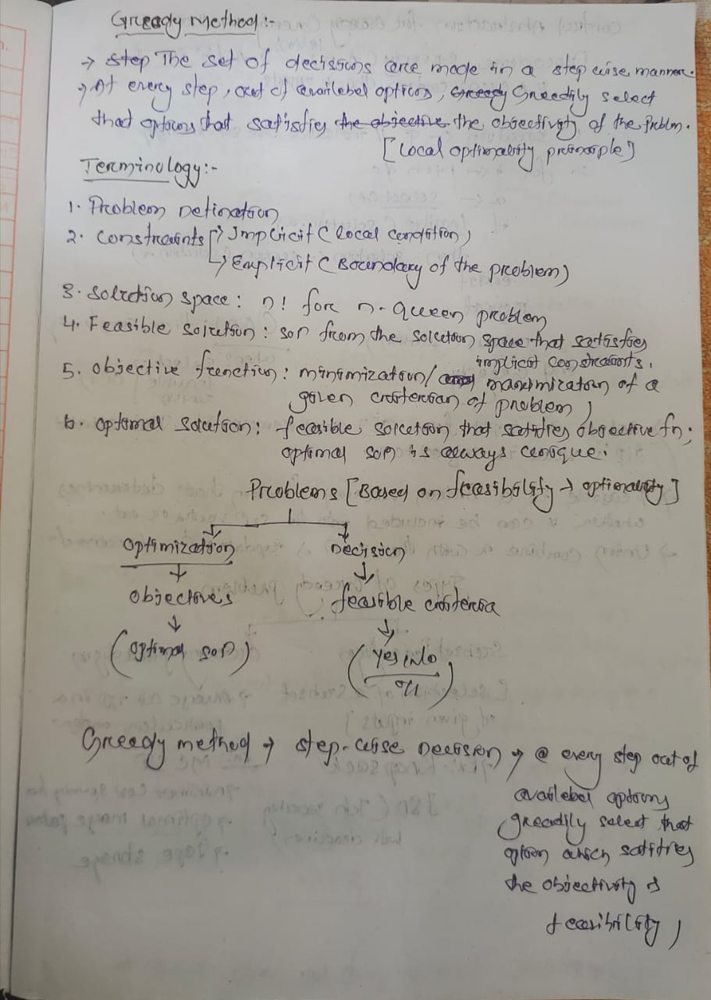
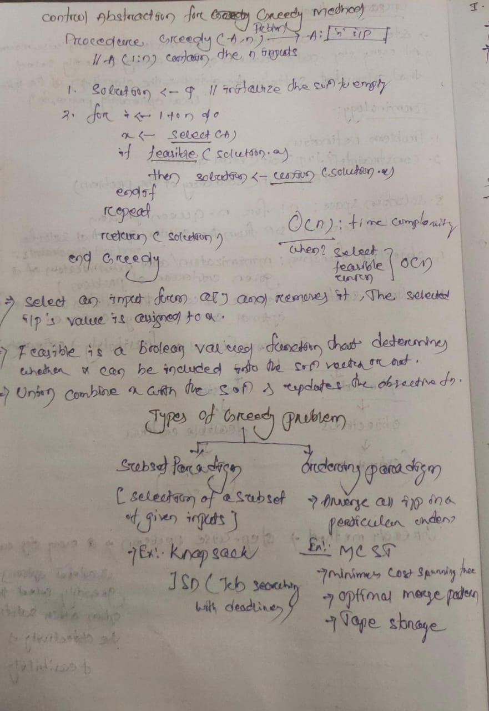
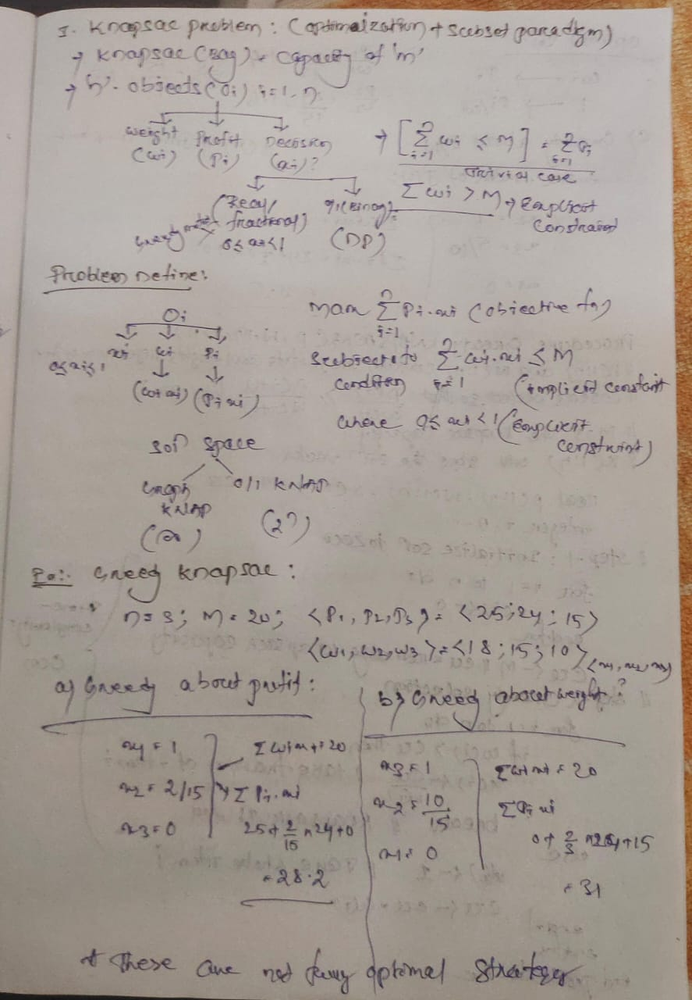
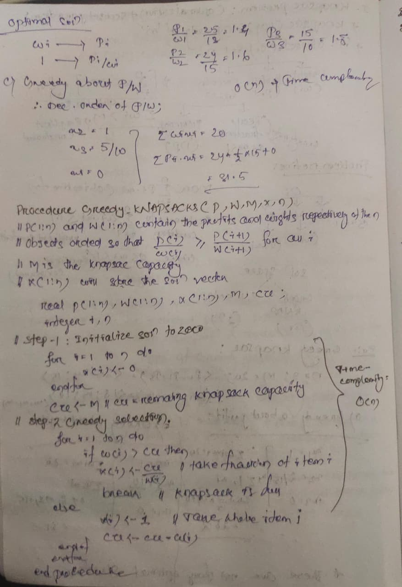

# 🗓️ Date: 2025-08-06

## ✅ Work Done
### Introduction to Greedy Method


### Control Abstraction for greedy method


### 1.Knapsack Problem


# 🛍️ Greedy Knapsack Algorithm (Fractional Knapsack)

## **Description**
The Greedy Knapsack algorithm selects items for a knapsack to maximize total profit without exceeding the capacity.  
This version works for the **fractional knapsack problem**, where fractions of an item can be taken.  
Items must be **sorted in non-increasing order of profit-to-weight ratio** before applying this algorithm.

---

## **Pseudocode**
```pseudo
Procedure GREEDY_KNAPSACK(P, W, M, X, n)
    // P(1:n) and W(1:n) contain the profits and weights of the n items
    // Items are sorted so that P(i)/W(i) ≥ P(i+1)/W(i+1) for all i
    // M is the knapsack capacity
    // X(1:n) will store the solution (fraction of each item taken)

    real P(1:n), W(1:n), X(1:n), M, cu
    integer i, n

    // Step 1: Initialize solution to zero
    for i = 1 to n do
        X(i) ← 0
    endfor

    cu ← M   // remaining knapsack capacity

    // Step 2: Greedy selection
    for i = 1 to n do
        if W(i) > cu then
            X(i) ← cu / W(i)   // take fraction of item i
            break               // knapsack is full
        else
            X(i) ← 1           // take whole item i
            cu ← cu - W(i)
        endif
    endfor
end Procedure```
---
[GREEDY_KNAPSACK](GREEDY_KNAPSACK.c)
