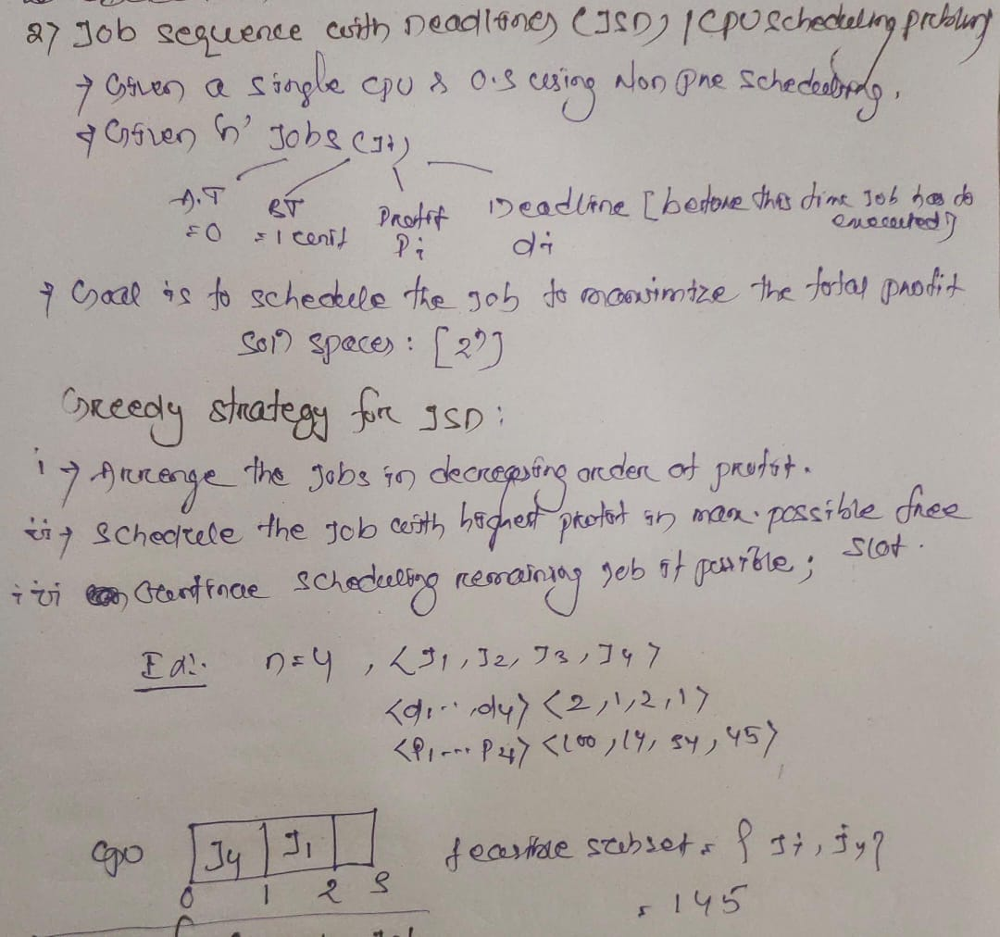

# 🗓️ Date: 2025-08-06

## ✅ Work Done

### Job Sequence with Deadline (JSD)/ CPU scheduling Problem


# 📅 Greedy Job Scheduling Algorithm

## **Description**
The **Greedy Job Scheduling** algorithm selects a set of jobs to maximize total profit while meeting job deadlines.  
Jobs are first **sorted in non-increasing order of profit** and then added one by one, keeping only those that can be completed before their deadlines.

---

## **Pseudocode**
```pseudo
Procedure GREEDY_JOB(d, P, n)
    // d(1:n) → deadlines of jobs
    // P(1:n) → profits of jobs
    // n      → number of jobs
    // Jobs are sorted in non-increasing order of profit

    1. J := {1}                  // Start with first job in the set
    2. for i := 2 to n do
    3.     Insert job i into J in order of deadline (Insertion Sort step)
    4.     if (all jobs in J can be scheduled before their deadlines) then
    5.         keep job i in J
    6.     else
    7.         remove job i from J
    8.     end if
    9. end for
end Procedure
