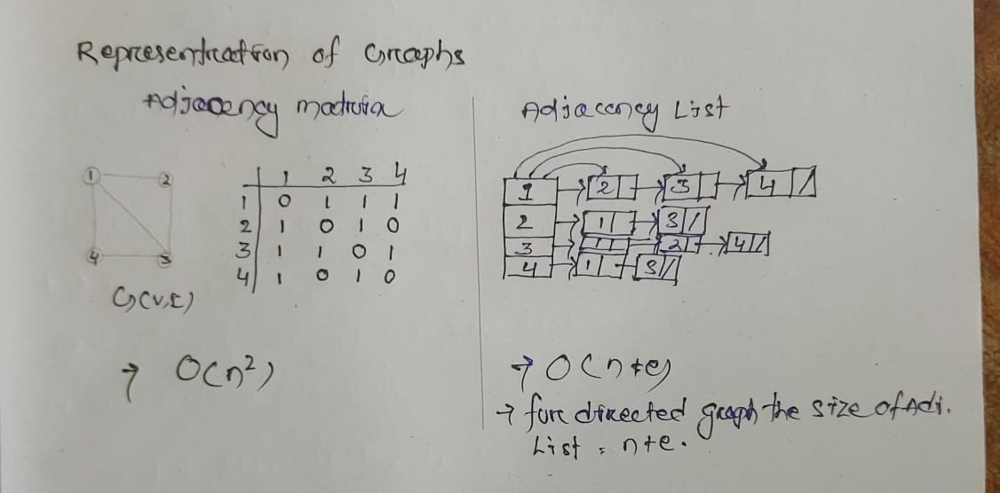
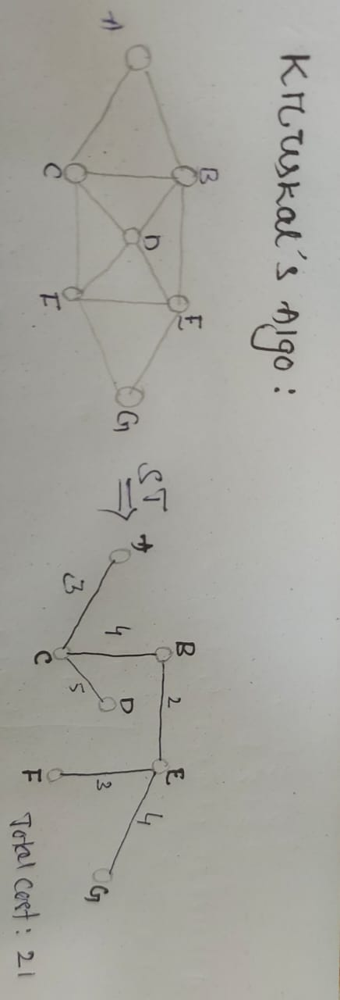

## Spanning Tree (ST)
- A connected subgraph T(V,E') of graph G(V,E) is said to be spanning tree if :
    - 'T' should be contain all vertices og "G' .
    - 'S' shouuld contain ('V'-1) edges .

 - **Note** Given a graph having 'n' vertices & 'e' edges of G(V,E) , then maximum no of spanning trees possible is **(n^n-2)** [ **solution space** ] 

### KRUSKAL'S ALGO:
- construct min heap with 'e' edges.
- Take one by one edges add in spanning tree ( cycle should not be created )
      - Best case (n-1) edges
      - worst case 'e' edges


## 🌳 Kruskal's Algorithm (Heap-Based)

```pseudo
Algorithm Kruskal(E, cost, n):

    // Step 1: Build heap from edges
    Construct a min-heap from all edges based on their costs.

    // Step 2: Initialize Disjoint Set
    for each vertex i from 1 to n:
        parent[i] := -1        // Initialize disjoint set

    // Step 3: Initialize variables
    edge_count := 0
    mincost := 0.0

    // Step 4: Process edges
    while (edge_count < n - 1) and (heap is not empty):
        (u, v) := DeleteMin(heap)   // Remove edge with smallest cost
        Reheapify(heap)
        j := Find(u)
        k := Find(v)

        if j ≠ k:
            edge_count := edge_count + 1
            t[edge_count, 1] := u
            t[edge_count, 2] := v
            mincost := mincost + cost[u, v]
            Union(j, k)

    // Step 5: Check if MST is possible
    if edge_count ≠ n - 1:
        print "❌ No spanning tree"
    else:
        return mincost

## Explanation

**Step 1 – Heapify Edges**  
- Construct a heap from all edges `(u, v)` using `cost[u, v]` as the key.
- Ensures quick access to the smallest-cost edge.

**Step 2 – Initialize Disjoint Set**  
- Set `parent[i] = -1` for all vertices `i` (each node starts in its own set).

**Step 3 – Initialize Variables**  
- `edge_count` tracks the number of edges in the MST.
- `mincost` accumulates the total MST cost.

**Step 4 – Main Loop**  
- Continue until we have `n-1` edges or the heap becomes empty.

**Step 5 – Pick Minimum Edge**  
- Extract the smallest edge `(u, v)` from the heap.
- Use **Find** to determine the representative (root) of each vertex.

**Step 6 – Avoid Cycles**  
- If `Find(u) ≠ Find(v)`:
  - Add edge `(u, v)` to MST.
  - Add its cost to `mincost`.
  - Merge the sets using **Union**.

**Step 7 – End Condition**  
- If fewer than `n-1` edges were added, the graph is disconnected.
- Otherwise, return the total `mincost`.

```

---
