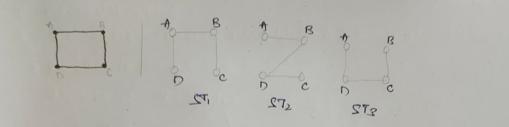
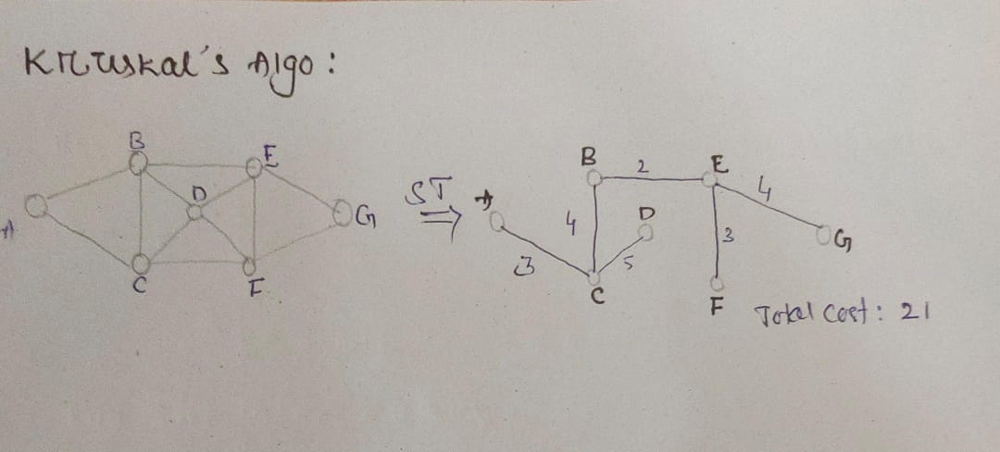

## Spanning Tree (ST)
- A connected subgraph T(V,E') of graph G(V,E) is said to be spanning tree if :
    - 'T' should be contain all vertices og "G' .
    - 'S' shouuld contain ('V'-1) edges .

 - **Note** Given a graph having 'n' vertices & 'e' edges of G(V,E) , then maximum no of spanning trees possible is **(n^n-2)** [ **solution space** ] 

### KRUSKAL'S ALGO:
- construct min heap with 'e' edges.
- Take one by one edges add in spanning tree ( cycle should not be created )
      - Best case (n-1) edges
      - worst case 'e' edges

